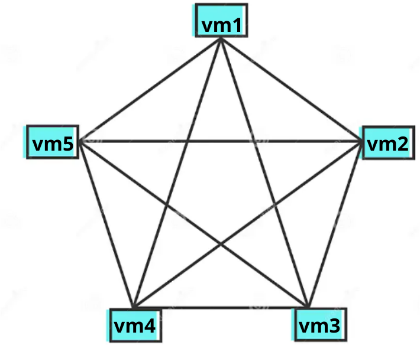

# Criacao-de-rede-empresarial
## 📰 Proposta
Esse repositório trata de documentar a projeção, criação, implantação e gerenciamento de uma rede empresarial com tecnologia Linux, contendo serivços como **DHCP, DNS, Web, FTP, NFS** e utilizando virtualização por meio de Vagrant e Docker.
Para cada serviço, será criado uma máquina virtual.
## Documentação
### Topologia da rede
A topologia escolhida para esta rede foi a `em malha`, no qual todas máquinas virtuais estarão conectadas por meio de muitas interconexões e assim permitindo que todos os serviços das vms estejam interligados.

### Segmentação de sub-redes

### Requisitos dos serviços

## 📎 Pré requisitos para sistema operacional Linux
* Instalar o [Virtual Box](https://virtualbox.org/) (Opte pela [versão 6.1](https://www.virtualbox.org/wiki/Download_Old_Builds_6_1) ou mais antiga) 
  
* Instalar o [Vagrant](https://developer.hashicorp.com/vagrant/downloads?product_intent=vagrant)
    
## 🔑 Criação e acesso as máquinas
1) Faça o clone do repositório do github para sua máquina.
   - Use o seguinte comando no diretório escolhido: `git clone https://github.com/Gabriel-Victor03/Criacao-de-rede-empresarial.git`
2) Acesse o repositório clonado
3) Dê o comando `vagrant up` para executar o arquivo Vagrantfile e subir as máquinas virtuais
4) Após encerrado o processo de criação das máquinas virtuais, acesse as máquinas usando o comando `vagrant ssh <nome_da_máquina>`
   - Nesse caso,para identificar cada máquina, use `vm1`, `vm2`,`vm3`,`vm4` e `vm5`
> Lembrando que é possível acessar todas as máquinas ao mesmo tempo, para isso, abra uma nova aba do termninal no local do respositório e dê o comando de acesso.
    
## 📶 Teste dos serviços

